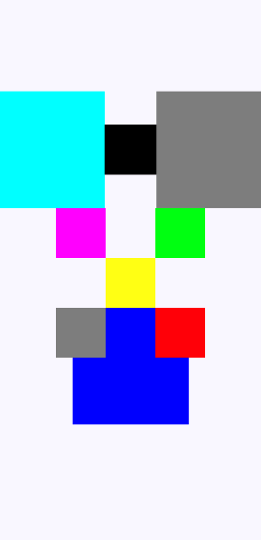
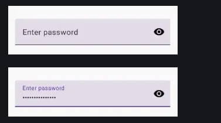
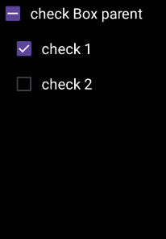

# Jetpack Compose – Soluciones de Ejercicios

Este repositorio está destinado a **subir y documentar las soluciones implementadas** para los ejercicios del **curso de Jetpack Compose**.

Cada ejercicio busca reforzar conceptos clave de Compose, aplicando buenas prácticas y distintos tipos de layouts.

---

## 📘 Ejercicio 1 – ConstraintLayout

### 📌 Descripción

Implementar en **Jetpack Compose** la siguiente figura utilizando los **diferentes tipos de layouts vistos en el curso**, haciendo énfasis en el uso de:

- `ConstraintLayout`
- `Row`
- `Column`
- `Box`
- Modificadores como `size`, `background`, `padding`, `alignment`, etc.

El objetivo es reproducir la disposición visual de los elementos respetando tamaños, posiciones y superposiciones.

---

### 🖼 Figura de referencia

---

### 🎯 Objetivos del ejercicio

- Comprender el uso de `ConstraintLayout` en Jetpack Compose
- Posicionar elementos relativos entre sí
- Combinar distintos layouts dentro de una misma pantalla
- Entender la jerarquía de composables y el orden de dibujo

---

### 🛠 Tecnologías utilizadas

- Kotlin
- Jetpack Compose
- Android Studio

--------

## 📘 Ejercicio 2 – TextField y Text

### 📌 Descripción

Implementar en **Jetpack Compose** el siguiente input de tipo password, con ofuscación y visualización mediante el click en el icono correspondiente:

----
### 🖼 Figura de referencia

--------

## 📘 Ejercicio 3 – CheckBox y TriStateCheckBox

### 📌 Descripción

Implementar en **Jetpack Compose** el siguiente triStateCheckBox el cual debe controlar a sus dos checkBox hijos, el triStateCheckBox debe habilitar a sus dos hijos si es habilitado y deshabilitarlos en caso de ser deshabilitado. De igual manera al clickar y habilitar los dos hijos el TriState padre se debe habilitar, caso contrario al deshabilitarlos. Si hay un hijo habilitado y otro deshabilitado, el tristate padre debe pasar a estado indefinido. 

----
### 🖼 Figura de referencia

